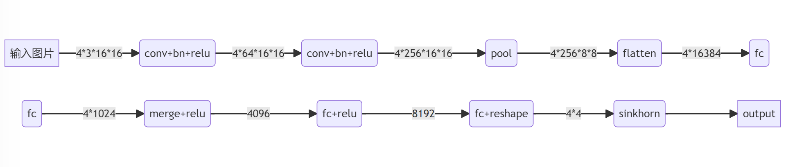

# Deep Learning Course Project 
This is the course project of Deep Learning and its Applications.

Partition an image into pieces and shuffle them. The goal is to design a neural network to restore the correct permutation. 

This is the structure of the network.
